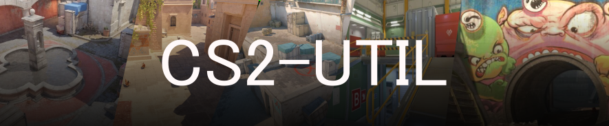

A visual guide for Counter-Strike 2 utility lineups and tactics. Browse through different maps to discover smoke throws, grenade positions, and strategic plays to improve your game.

## 🎯 What is this?

CS2 Util is an interactive web app that helps CS2 players learn and master utility throws across competitive maps. Each lineup includes visual references showing exactly where to stand and how to throw your grenades.

## ✨ Features

- **Visual Guides** - Step-by-step images for each lineup
- **Filter by Position** - Find utility for T-side or CT-side
- **Tag System** - Search by location (A, B, MID) and grenade type (SMOKE, FLASH, MOLLY)
- **Dark Mode** - Comfortable viewing in any lighting
- **Responsive Design** - Works on desktop and mobile devices

## 🚀 Getting Started

```bash
# Install dependencies
npm install

# Start the development server
npm run dev

# Build for production
npm run build
```

## 🛠️ Built With

- React & TypeScript
- Vite
- Tailwind CSS


